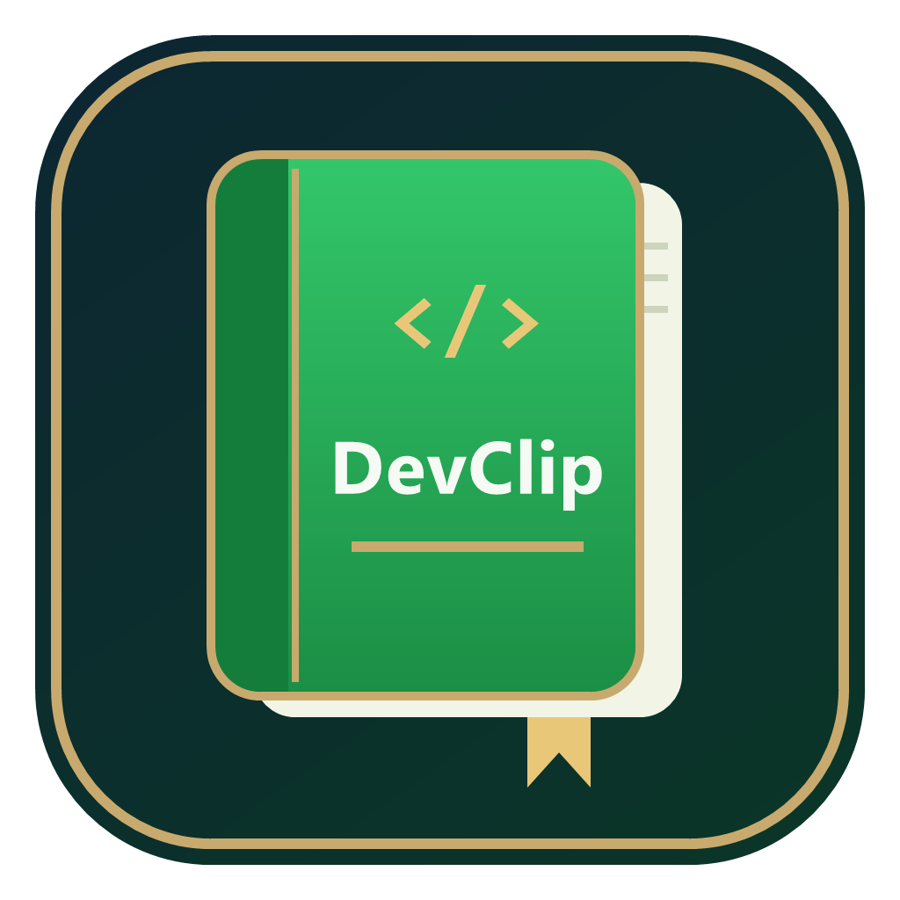
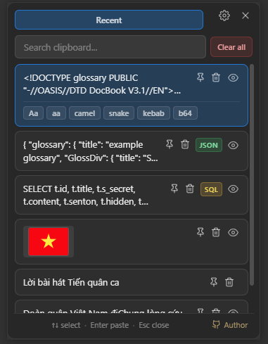

# DevClip

**A background clipboard manager built for developers — a smarter `Win + V`.**

English · [Tiếng Việt](README.vi.md)

> Copy anything, press **Alt + V**, and paste it back — with developer super‑powers like JSON/SQL formatting, case transforms, pinning and fullscreen preview.

## 📸 Screenshots

| Clipboard History | Settings |
|---|---|
|  |  |

---

## ✨ Highlights

- 🧑‍💻 **Format‑aware** — auto‑detects **JSON** and **SQL**, pretty‑prints them on paste.
- 🔤 **String transforms** — `UPPER`, `lower`, `camelCase`, `snake_case`, `kebab-case`, **Base64**.
- 📌 **Pin & reorder** — pin items to the top and **drag‑and‑drop** to arrange them.
- ⌨️ **Custom hotkey + search** — change the global shortcut and filter history as you type.
- 🔍 **Fullscreen preview** — open the full image or long text in a large popup.
- 🗔 **Lives in the tray** — pastes straight into the window you were working in.

---

## 🆚 DevClip vs. Windows + V

| | Windows + V | DevClip |
|---|:---:|:---:|
| Audience | General users | **Developers** |
| History size | — | **10–500 (configurable)** |
| Hotkey | Fixed `Win+V` | **Customizable** |
| Search | ❌ | ✅ |
| Code formatting (JSON/SQL) | ❌ | ✅ |
| String transforms | ❌ | ✅ |
| Pin | ✅ | ✅ + **drag to reorder** |
| Fullscreen preview | ❌ | ✅ |
| Open source | ❌ | ✅ |

> DevClip isn’t meant to fully replace Win + V — it streamlines the **developer** workflow.

---

## 🚀 Installation

> Windows 10/11, 64‑bit.

**Option 1 — Installer (recommended)**
1. Download **`DevClip-amd64-installer.exe`** from the [latest release](https://github.com/hieudeptrai196/dev_clip/releases/latest).
2. Run it and follow the steps. It installs DevClip and adds a Start‑menu shortcut.

**Option 2 — Portable**
- Download **`DevClip.exe`** from the [latest release](https://github.com/hieudeptrai196/dev_clip/releases/latest) and run it directly — no install needed.

> ℹ️ The app isn’t code‑signed yet, so Windows SmartScreen may warn on first launch. Click **More info → Run anyway**.

---

## 📖 Usage

| Shortcut | Action |
|---|---|
| `Alt + V` | Open the popup at the cursor |
| `↑` / `↓` | Move selection |
| `Enter` | Paste the selected item |
| `Esc` | Close |

1. **Copy** anything (text or image) as usual.
2. Press **`Alt + V`** — the popup appears at your cursor with the history.
3. Pick an item and press **Enter** (or click) to paste it into the app you were in.
4. **Hover** an item to pin 📌 / delete 🗑; click the **eye** icon for a fullscreen preview.
5. The **tray icon** has a right‑click menu (Show / Settings / Quit); double‑click it to open the popup.
6. Open **⚙ Settings** to change the hotkey, history size, or enable start‑with‑Windows.

---

## 🎯 Features

**Clipboard capture**
- Automatically captures copied **text and images**.
- A capped history (10–500) with **de‑duplication** — re‑copying an item bumps it to the top.
- Image thumbnails loaded on demand.

**Popup & paste**
- Global hotkey opens the popup **at the cursor**; instant case‑insensitive search.
- Pastes into the **previously focused window** and **restores your previous clipboard** afterwards.
- Frameless, always‑on‑top, translucent window; **drag to move**.

**Item actions**
- **Pin** to top (survives history limits) and **drag‑to‑reorder** pinned items.
- **Delete** a single item or **Clear all**.
- **Fullscreen preview** of long text and images.

**Formatter (for devs)**
- Detects **JSON / SQL** and shows a badge.
- Pretty‑print **JSON** (indented) and **SQL** (uppercased keywords, clause line‑breaks).
- Transform & paste: `UPPER`, `lower`, `camelCase`, `snake_case`, `kebab-case`, **Base64**.

**System integration**
- **System‑tray** icon with menu + double‑click to open.
- **Single instance**, **minimize‑to‑tray** on close, optional **start with Windows**.

---

## ⭐ Support

If you find DevClip useful, please consider giving it a **star** ⭐ — it really helps!

Or **buy me a coffee** ☕ by scanning the QR code below:

  

## 👤 Author

Made by [**@hieudeptrai196**](https://github.com/hieudeptrai196).

Built with [Go](https://go.dev), [Wails](https://wails.io) and [React](https://react.dev).
