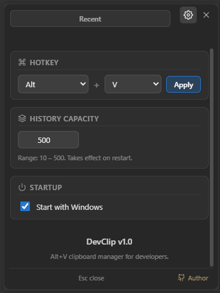

# DevClip

**DevClip** is a lightweight, high-performance clipboard manager designed specifically for developers. It serves as a modern, customizable alternative to the default Windows `Win+V` shortcut.

Unlike other clipboard managers, DevClip stores history strictly in-memory (RAM) — when you quit the application, your clipboard history vanishes, ensuring no traces are left on your storage disk.

## Features

- **Blazing Fast Alt+V Popup:** Positioned right under your cursor for swift access.
- **Developer-Focused Transforms:** Instantly transform text items on paste (UPPERCASE, lowercase, camelCase, snake_case, kebab-case, or Base64 encode/decode).
- **Intelligent Formatting:** Built-in automatic format detection and pretty-printing for JSON and SQL snippets.
- **Visual Image History:** Full support for copying and displaying screenshots and images.
- **Security Blocklist:** Automatically drops captures coming from sensitive applications (e.g., password managers like 1Password, Bitwarden, KeePass, KeePassXC).
- **Persistent Pinned Items:** Pin your most frequently used templates or code blocks. Drag-and-drop to reorder them in the list.
- **Autostart & Customizable Hotkey:** Configure your preferred launch hotkey and set the app to run on Windows startup.

## Preview

| Clipboard History | Settings |
|---|---|
|  |  |

## Tech Stack

- **Backend:** Go 1.22+, utilizing raw Win32 APIs for system hooks, hotkeys, and window management.
- **Frontend:** React + TypeScript (Vite) styled with clean modern dark-mode CSS.
- **Bridge:** Wails v2 framework for seamless communication between the Go runtime and WebView2.

## Getting Started

### Prerequisites

To build and run DevClip, you will need:

- **Go** (v1.22 or higher)
- **Node.js** & **npm** (for the React frontend)
- **Wails CLI** (v2)
- Windows 10/11 with WebView2 runtime installed (default on modern Windows).

To install Wails CLI:
```bash
go install github.com/wailsapp/wails/v2/cmd/wails@latest
```

### Installation & Development

1. Clone the repository:
   ```bash
   git clone https://github.com/hieudeptrai196/dev_clip.git
   cd dev_clip
   ```

2. Run in development mode:
   ```bash
   wails dev
   ```

3. Build the production binary:
   ```bash
   wails build
   ```

## Author

- **hieunt** ([github.com/hieudeptrai196](https://github.com/hieudeptrai196))

## License

This project is licensed under the [MIT License](LICENSE).
