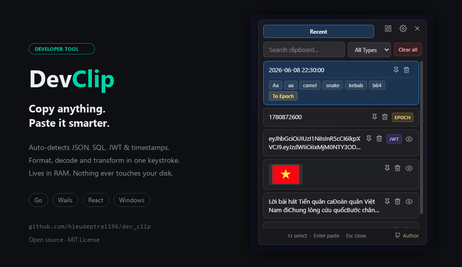
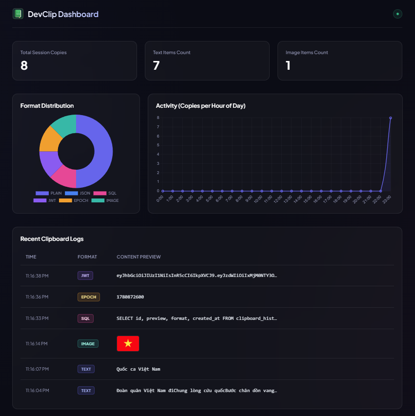

  

# DevClip

**Clipboard manager chạy ngầm dành cho lập trình viên — đơn giản như `Win + V`, chỉ là thông minh hơn.**

[English](README.md) · Tiếng Việt

> Không cần cài đặt, không cần học gì: copy bất cứ thứ gì, bấm **Alt + V** rồi dán lại. Các "siêu năng lực" cho dev — format JSON/SQL, biến đổi chuỗi, giải mã JWT, ghim và preview toàn màn hình — luôn sẵn ngay khi bạn cần.

## 📸 Ảnh chụp màn hình

### Dashboard Web Cục Bộ

### Ứng dụng Desktop
| Lịch sử Clipboard | Cài đặt |
|---|---|
|  |  |

---

## ✨ Điểm nổi bật

- 🧑‍💻 **Nhận biết định dạng** — tự động nhận diện **JSON**, **SQL**, **JWT**, và **Timestamp** (nhãn gắn tự động).
- 🔑 **Giải mã JWT** — hiển thị Header & Payload trực quan dạng split-view kèm banner trạng thái hết hạn thời gian thực.
- 📅 **Chuyển đổi Epoch** — chuyển đổi nhanh Unix Timestamp sang ngày giờ địa phương và ngược lại.
- 🗜️ **JSON/SQL Minifier** — nén code JSON và truy vấn SQL thành một dòng duy nhất khi dán.
- 📊 **Dashboard Web cục bộ** — mở trang dashboard giao diện glassmorphic dark-mode hiển thị biểu đồ phân bố và tần suất sao chép.
- 📌 **Ghim & sắp xếp** — ghim item lên đầu và **kéo‑thả** để xếp lại thứ tự.
- ⌨️ **Hotkey tuỳ chỉnh + tìm kiếm** — đổi phím tắt toàn cục và lọc lịch sử khi gõ.
- 🔍 **Preview toàn màn hình** — mở full ảnh, text dài, hoặc token JWT đã giải mã trong popup lớn.

---

## 🆚 DevClip so với các công cụ khác

DevClip đứng trên 3 trụ cột mà các lựa chọn khác không gộp được:

- 🔒 **Riêng tư từ thiết kế** — lịch sử chỉ nằm trên RAM, bốc hơi khi thoát, và tự bỏ qua các app nhạy cảm (trình quản lý mật khẩu). Win + V, Raycast và CopyQ đều lưu lịch sử xuống ổ cứng.
- 🧑‍💻 **Sinh ra cho code** — tự nhận diện và decode JSON, SQL, JWT, timestamp, kèm biến đổi chuỗi và nén. Các tool kia đều đa dụng chung chung.
- 🆓 **Miễn phí, mã nguồn mở & nhẹ** — không subscription, không tài khoản, footprint Go + Wails nhỏ gọn.
- ⚡ **Quen tay & zero‑setup** — dùng y như Win + V: bấm hotkey, chọn, dán. Không file config, không khái niệm phải học, không rườm rà như CopyQ. Công cụ cho dev có sẵn khi cần, và "ẩn đi" khi không cần.

| | Windows + V | Raycast | CopyQ | **DevClip** |
|---|:---:|:---:|:---:|:---:|
| Nền tảng | Windows | macOS + Windows *(beta)* | Win / Mac / Linux | Windows |
| Giá / license | Built‑in | Freemium, Pro $8+/th | Free, mã nguồn mở | **Free, mã nguồn mở** |
| Hướng tới | Người dùng phổ thông | Launcher đa năng | Power clipboard | **Clipboard cho dev** |
| Lưu lịch sử | Ổ cứng | Ổ cứng (mã hoá) | Ổ cứng | **Chỉ RAM** ⭐ |
| Xoá khi tắt máy | ❌ | ❌ | ❌ | **✅** ⭐ |
| Tự bỏ qua app mật khẩu | ❌ | ❌ | ❌ | **✅** ⭐ |
| Format + nén JSON / SQL | ❌ | ❌ | scripting | **✅** ⭐ |
| Giải mã JWT | ❌ | ❌ | ❌ | **✅** ⭐ |
| Đổi Epoch ⇄ ngày | ❌ | ❌ | ❌ | **✅** ⭐ |
| Biến đổi chuỗi | ❌ | qua extension | qua scripting | **✅ sẵn** |
| Tìm kiếm | ❌ | ✅ | ✅ | ✅ |
| Ghim / sắp xếp | ✅ | ✅ | ✅ (tabs) | ✅ + **kéo‑thả** |
| Hotkey tuỳ chỉnh | ❌ | ✅ | ✅ | ✅ |
| Độ nặng | OS sẵn | Nặng hơn | Nhẹ (Qt) | **Nhẹ (Go + Wails)** |
| Cài đặt / độ khó làm quen | Không | Thấp | **Khó** | **Không — dùng như Win + V** |

⭐ = chỉ DevClip có trong nhóm này.

**Nên chọn cái nào?**

- **Raycast** — launcher all‑in‑one kèm AI, tốt nhất trên macOS.
- **CopyQ** — đa nền tảng, scripting sâu, lưu trữ lâu dài.
- **DevClip** — clipboard **riêng tư, cho dev, trên Windows, zero‑setup**.

---

## 🚀 Cài đặt

> Windows 10/11, 64‑bit.

**Cách 1 — Installer (khuyên dùng)**
1. Tải **`DevClip-amd64-installer.exe`** từ [Google Drive](https://drive.google.com/file/d/1sjutFfZesOxkNCqL9t3olw5J80enEV1h/view?usp=sharing).
2. Chạy file và làm theo các bước. App được cài kèm shortcut ở Start Menu.

**Cách 2 — Portable**
- Tải **`DevClip.exe`** từ [Google Drive](https://drive.google.com/file/d/1-v_gISTK4fH9cEbBL1x_nczpcadOvSx8/view?usp=sharing) và chạy thẳng — không cần cài.

> ℹ️ App **chưa ký số** nên lần đầu chạy Windows SmartScreen có thể cảnh báo. Bấm **More info → Run anyway**.

---

## 📖 Cách dùng

| Phím tắt / Hành động | Tác dụng |
|---|---|
| `Alt + V` | Mở popup tại con trỏ |
| `↑` / `↓` | Di chuyển lựa chọn |
| `Enter` | Dán item đang chọn |
| `Esc` | Đóng |
| **Nút Dashboard** 📊 | Click vào biểu tượng bên cạnh Settings Gear để mở Dashboard trên trình duyệt web |

1. **Copy** bất cứ thứ gì (text hoặc ảnh) như bình thường.
2. Bấm **`Alt + V`** — popup hiện ngay tại con trỏ kèm lịch sử.
3. Chọn một item rồi bấm **Enter** (hoặc click) để dán vào app bạn đang làm.
4. **Hover** vào item để ghim 📌 / xoá 🗑; bấm icon **con mắt** để xem preview toàn màn hình hoặc xem JWT giải mã.
5. **Icon ở khay hệ thống** có menu chuột phải (Show / Settings / Quit); double‑click để mở popup.
6. Vào **⚙ Settings** để đổi hotkey, dung lượng lịch sử, hoặc bật khởi động cùng Windows.

---

## 🎯 Tính năng

**Bắt clipboard**
- Tự động bắt **text và ảnh** khi copy.
- Lịch sử giới hạn (10–500) có **chống trùng** — copy lại item cũ thì nó nhảy lên đầu.
- Thumbnail ảnh tải khi cần.

**Popup & dán**
- Hotkey toàn cục mở popup **ngay tại con trỏ**; tìm kiếm tức thì, không phân biệt hoa thường.
- Dán vào **cửa sổ đang làm việc trước đó** và **khôi phục clipboard cũ** sau khi dán.
- Cửa sổ frameless, luôn nổi trên cùng, trong mờ; **kéo để di chuyển**.

**Thao tác item**
- **Ghim** lên đầu (không bị giới hạn lịch sử đẩy ra) và **kéo‑thả sắp xếp** item đã ghim.
- **Xoá** từng item hoặc **Clear all**.
- **Preview toàn màn hình** cho text dài, hình ảnh, và token JWT.

**Công cụ cho lập trình viên**
- **JSON / SQL Formatter**: Pretty-print (căn lề đẹp) và **Minify** (nén thành 1 dòng) khi dán.
- **JWT Decoder**: Giải mã token thành Header/Payload trong preview với banner hiển thị thời gian sống còn lại của token.
- **Timestamp Converter**: Đọc số copy và hiển thị Epoch timestamp, hỗ trợ dán dạng ngày giờ local, hoặc chuyển chuỗi ngày giờ local sang Epoch.
- **Local Web Dashboard**: Chạy web server nội bộ hiển thị các thống kê định dạng, biểu đồ cột thời gian copy, và nhật ký lịch sử.

**Tích hợp hệ thống**
- Icon ở **khay hệ thống** có menu + double‑click để mở.
- **Chỉ một bản chạy**, **thu nhỏ xuống tray** khi đóng, tuỳ chọn **khởi động cùng Windows**.

---

## ⭐ Ủng hộ

Nếu thấy DevClip hữu ích, cho mình xin một **star** ⭐ nhé — rất có ý nghĩa với mình!

Hoặc **mời mình một ly cà phê** ☕ bằng cách quét mã QR bên dưới:

  

## 👤 Tác giả

Thực hiện bởi [**@hieudeptrai196**](https://github.com/hieudeptrai196).

Xây dựng bằng [Go](https://go.dev), [Wails](https://wails.io) và [React](https://react.dev).
